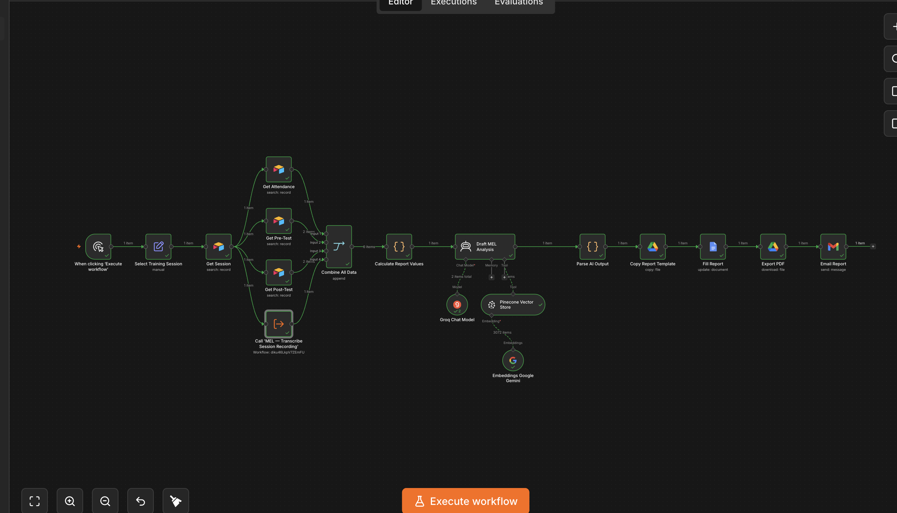
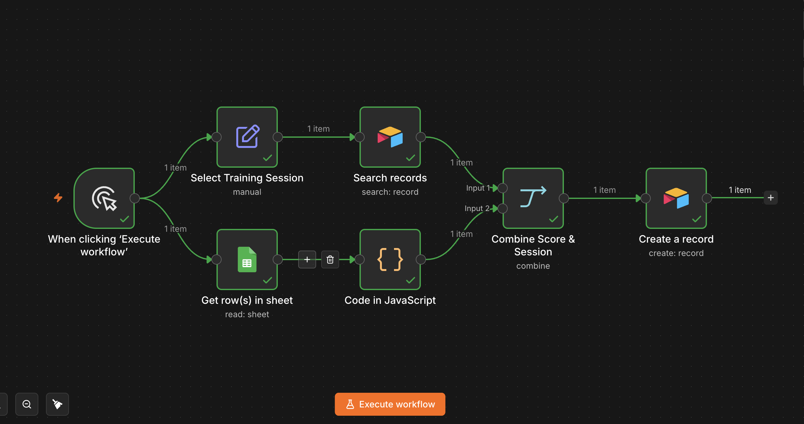
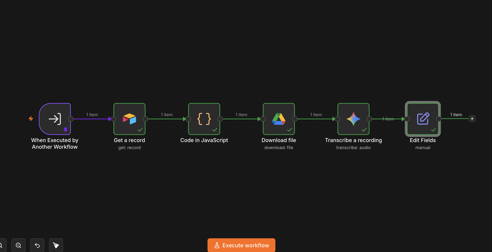
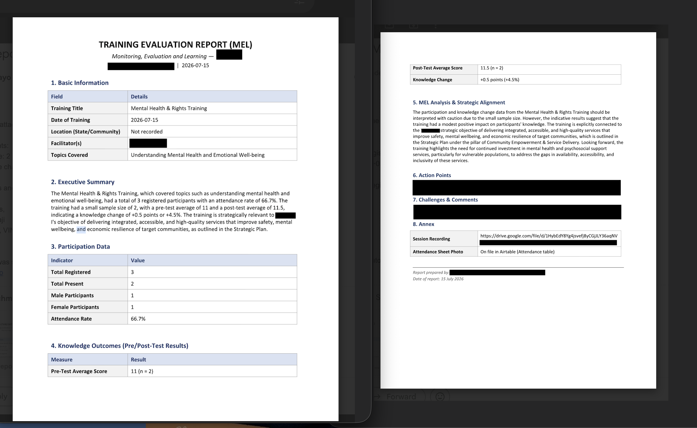
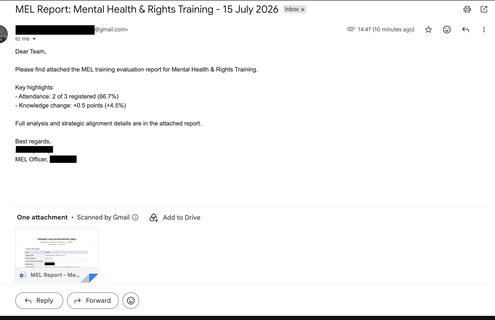

# Automated MEL Reporting System

An end-to-end automation pipeline that turns raw training data into AI-generated Monitoring, Evaluation and Learning (MEL) reports — built for **VINAAA-I** (Voices in Nigeria Adolescents and Advocacy Initiative).

## What It Does

Training programs generate a lot of data — attendance, pre-test scores, post-test scores — that usually sits in spreadsheets and never becomes a real report. This system closes that gap automatically:

1. **Pre-Test** — Participants complete a Google Form before training. Responses land in a Google Sheet, which is synced into Airtable (Pre-Test Table).
2. **Attendance** — Recorded manually into Airtable during the session.
3. **Training Delivery** — Facilitators run the training session, and the session is recorded.
4. **Post-Test** — Participants complete a Google Form after training, following the same Google Sheet -> Airtable sync as the pre-test.
5. **Recording Upload** — The session recording is uploaded to Google Drive, and the link is manually pasted into the Airtable Session record. This is the final manual step before report generation.
6. **Report Generation (manual trigger)** — Once all data is in Airtable, the n8n workflow is triggered manually. It pulls the session, attendance, pre-test, and post-test records, and calls a sub-workflow that downloads the recording, transcribes it, and extracts the qualitative content.
7. **AI-Generated Report** — An AI agent (Groq) combines the quantitative scores with the qualitative transcript summary, evaluates outcomes against VINAAA-I's strategic plan (retrieved via a Pinecone vector store — no raw strategic plan document is stored in this repo), and generates the full report as structured JSON.
8. **Delivery** — The report is filled into a Google Doc template, exported to PDF, and delivered via Gmail to the relevant stakeholders.

## Why It Matters

MEL reporting is usually manual, slow, and inconsistent — someone has to pull numbers, write a narrative, and format a document by hand. This system removes that bottleneck: once attendance and scores are logged, the report writes and sends itself, consistently, every time.

## Architecture

**Data collection (before the workflow runs):**
Google Forms (Pre-Test) -> Google Sheets -> Airtable (Pre-Test Table)
Google Forms (Post-Test) -> Google Sheets -> Airtable (Post-Test Table)
Manual entry -> Airtable (Attendance Table)
Session Recording -> Google Drive -> Link pasted manually into Airtable (Session record)

**Report generation (manually triggered in n8n once the above is complete):**
Get Session -> [Get Attendance | Get Pre-Test | Get Post-Test | Call Transcription Sub-Workflow] -> Combine All Data
        -> Calculate Report Values
        -> AI Agent (Groq) + Pinecone (Strategic Plan Alignment)
        -> Parse AI Output
        -> Google Docs (Report Template Fill)
        -> Google Drive (Export to PDF)
        -> Gmail (Delivery)

**Transcription sub-workflow (called from the main flow):**
Get Session Record -> Extract Recording File ID -> Download from Google Drive -> Transcribe (Gemini) -> Return Transcript

## Tech Stack

- **n8n** — workflow orchestration (self-hosted)
- **Airtable** — training data storage (attendance, pre-test, post-test)
- **Groq (Llama 3.3 70B)** — AI report generation
- **Pinecone** — vector store for strategic plan alignment
- **Google Docs / Drive** — report templating and PDF export
- **Gmail** — automated report delivery
- **Gemini** — session recording transcription

## Data & Privacy

This repository contains **workflow logic only**. No real participant data, attendance records, test scores, or VINAAA-I's actual strategic plan document are included or committed at any point.

## Status

Actively in development. Core pipeline is working end-to-end: attendance/score sync, session recording transcription, AI report generation, and Gmail delivery.

## How It Works — Output Walkthrough

### 1. Workflow Overview

### 2. Attendance & Pre-Test Sync to Airtable

### 3. Transcription Sub-Workflow

### 4. AI-Generated Report Output

### 5. Delivered via Gmail

